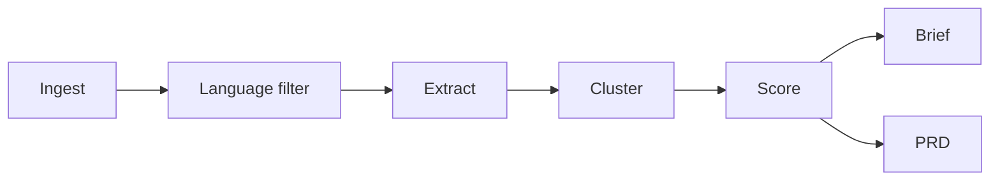

# Feedback-to-Decision Engine

A local Python pipeline that turns app store reviews into a ranked, evidence-traced opportunity brief and a draft PRD. Every quoted complaint traces to a source review.

## The finding

Across 2,927 English-language SoundCloud Android reviews:

- **Most-mentioned complaint, by a wide margin:** `excessive ads` (208 reviews; roughly 1.4x the next-most-mentioned theme).
- **Highest-priority opportunity, when reach is weighted by severity and strategic fit:** `playback pauses during songs` (72 reviews, score 0.895). `excessive ads` falls to **#3** (score 0.837).

The two are not the same question. Reviewers describe ads as repeated friction (mean severity 2.46 / 3.00); they describe playback pauses as core-listening breakage (mean severity 2.81 / 3.00), and acting on ad load conflicts with the free-tier revenue model in a way that fixing a playback bug does not. A flat-strategic-fit robustness check confirms the same three themes occupy the top three positions regardless of how the fit weights are set, so the ordering at the top is signal-driven, not weight-driven.

This engine exists to make "most-mentioned" vs. "highest-priority" a rigorous, traceable distinction instead of a guess.

## See the output

- **[Opportunity brief](brief/opportunity_brief.md)** - all 21 ranked themes with reach, mean severity, score breakdown, 2-3 verbatim on-theme quotes per theme (cited by review_id), and a one-line recommendation.
- **[Draft PRD for the top theme](brief/top_theme_prd.md)** - one-page Lenny-style PRD for `playback pauses during songs`.

## What it is

Raw Google Play reviews go in. A markdown opportunity brief and a draft PRD for the top opportunity come out. The LLM does open-ended structuring against a neutral schema; prioritization, clustering, scoring, and quote selection are deterministic code you can read.

## Pipeline



1. **Ingest** (`ingest/soundcloud.py`): pulls newest reviews for a target app into normalized JSONL. SoundCloud Android, US storefront, 3,000 reviews in this run.
2. **Language filter** (`ingest/language_filter.py`): drops non-English reviews via lingua-py at min_confidence 0.5. Dropped reviews are preserved with detected language for audit; 2,927 / 3,000 kept.
3. **Extract** (`extract/run.py`): each review goes through Anthropic Claude Haiku 4.5 against a neutral schema (`theme`, `severity`, `sentiment`, `feature_area`, `segment_hint`). Schema enforced at the API boundary via tool-calling, so enum compliance is free. Results cached on disk per review_id so reruns are cheap. 1,387 issues extracted.
4. **Cluster** (`cluster/run.py`): local sentence-transformers `all-MiniLM-L6-v2` embeddings, sentiment-partitioned agglomerative clustering at cosine 0.45, medoid labels. 90 clusters retained; each member carries its `centroid_sim` so downstream stages can rank by representativeness without re-embedding.
5. **Score** (`score/run.py`): weighted ranking with three components (log-scaled frequency, mean severity normalized by config scale, per-feature-area strategic fit). 21 themes clear the volume floor (`ranking_min_size: 10`) and get written to a ranked JSONL with a per-theme contribution breakdown.
6. **Brief** (`brief/run.py`): renders the markdown opportunity brief. Quote selection ranks by `centroid_sim` with a 0.82 display floor.
7. **PRD** (`brief/prd.py`): renders a one-page Lenny-style PRD for the top-ranked theme.

## Design decisions

**Neutral extraction schema.** The extractor prompt names no specific complaints, no apps, no priors. If `excessive ads` tops the volume list, that is reviewer language, not a prompt that asked the model to find ad complaints. The prompt and the schema live in `config/extraction_schema.yaml` and are short enough to read in one sitting.

**Sentiment-partitioned clustering.** Issues are split by sentiment before any agglomerative merge, so a positive cluster (subscriber praise: "no ads, love it") cannot merge with its negative inverse ("too many ads"). Opposite-direction concerns stay separate by construction.

**Medoid labels, not mode labels.** Each cluster is labeled with the member whose embedding is closest to the cluster centroid, not the most-frequent theme string. An early run labeled a playback-interruption cluster as "app crashes during playback" because that wording happened to repeat; the medoid label surfaces the cluster's actual semantic center.

**Config-driven weights with documented rationale.** `config/weights.yaml` holds the frequency / severity / strategic_fit weights, the severity numeric scale, and a per-feature-area rationale comment for every strategic_fit value (why `monetization` is 0.5 and `core_listening` is 1.0). Editing weights is a config change; the reasoning behind every number is auditable in the same file.

**Log-scaled frequency and a volume floor for ranking.** Cluster sizes are heavy-tailed (208, 147, 72, then a long tail). Linear min-max normalization collapsed mid-tier frequencies to near zero and let severity dominate every rank below #1. Log scaling restores mid-tier differentiation. A `ranking_min_size` of 10 keeps clustering's tiny clusters out of the ranked output, so a high-severity 3-member cluster cannot float into a top-N priority list.

**Centroid-sim quote selection.** Quotes are ranked by each member's cosine similarity to the cluster centroid, then by review-text length, then by star rating as a late tiebreaker. A display floor of 0.82 drops residual off-direction members; themes that cannot field 2 quotes above the floor show 1 or 0 with no backfill. The brief documents that case rather than papering over it.

**Flat-fit robustness check.** When `strategic_fit` is set to a flat 1.0 across feature areas, the same three themes still occupy the top three positions (`playback pauses`, `country availability`, `excessive ads`). The top of the ranking is signal-driven, not an artifact of weights set during scaffolding.

## Evidence discipline

- **Every quoted line cites a `review_id`.** No quote is generated or paraphrased. The `centroid_sim` floor keeps quotes on-theme.
- **PRD numeric targets are TBD, not invented.** Every target in the goals and success-metrics section reads "TBD (set with data/eng after baseline)."
- **The PRD does not claim a solution.** Each solution-direction item is tagged "(Draft, needs eng discovery)." Hypotheses are framed as things eng discovery should rule in or out.

## Validation

The extraction stage is checked against a 50-review stratified blind hand-labeled set (`evals/`). Review-level detection agrees with the labels 94% of the time (n=50) with zero misses. Every one of the 61 model-extracted issues traced to real review text, so there are no hallucinated issues; the apparent precision gap is labeling granularity, since the gold captured one issue per review while the model decomposes multi-issue reviews. Feature_area agreement is 68% among matched issues, with the residual driven by two complaint types the schema has no category for, app-stability and downloads. Full numbers and failure modes: [`evals/results.md`](evals/results.md).

## Limitations

- **A single similarity threshold cannot fit every concept's natural granularity.** The 0.45 cosine cut consolidates the long-tail ad cluster cleanly but leaves two low-rank clusters carrying directionally mixed concerns: theme 13 (`same songs repeat frequently`) blends "songs auto-repeating" with "cannot manually repeat"; theme 18 (`missing original artist information`) blends missing metadata with obscure-artist catalog complaints. The render-time `centroid_sim` floor reduces this but cannot rewrite the cluster boundary; the brief states this plainly in its "Method and limitations" note.
- **One app, one snapshot.** 3,000 reviews from a single US-storefront Google Play pull on a single date. Trends across versions, markets, or time are not addressed here.
- **Review data only.** No telemetry, no funnel data, no causal claims. Reviewers are a biased sample (people upset enough to write, or delighted enough to recommend). "Playback pauses ranks #1" means it has the highest weighted reach in this complaint corpus, not that it is necessarily the highest engineering impact in production. The pipeline surfaces priorities; engineering discovery confirms them.

## Run it

Setup (PowerShell):

```powershell
python -m venv .venv
.venv\Scripts\Activate.ps1
pip install -r requirements.txt
Copy-Item .env.example .env   # then set ANTHROPIC_API_KEY
```

End-to-end:

```powershell
python -m ingest.soundcloud
python -m ingest.language_filter
python -m extract.run
python -m cluster.run
python -m score.run
python -m brief.run
python -m brief.prd
```

Outputs land in `brief/opportunity_brief.md` and `brief/top_theme_prd.md`. Intermediate JSONL artifacts go to `data/` (gitignored).
